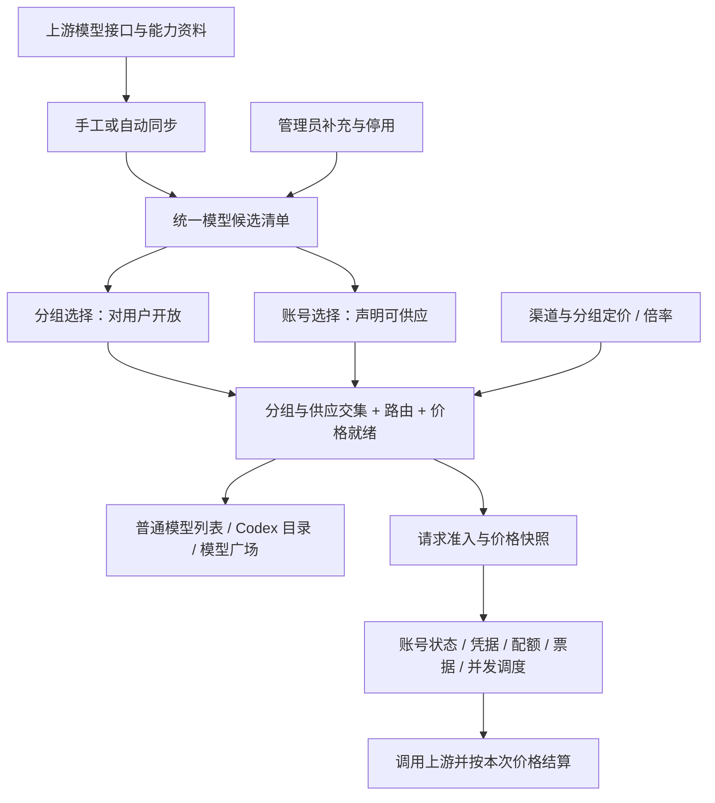

# 模型清单、开放范围与定价

共享实现先在 main（KDAN）完成，再同步到 TapModels、tokensavy。本文描述统一目录与 Codex 固定来源的分层方案；固定来源只控制清单发现，不替代目录治理或推理调度。

## 每个入口只负责一件事

| 入口 | 职责 |
| --- | --- |
| `/admin/model-catalog` 模型清单 | 集中维护分组、账号可勾选的模型候选，相当于从旧分组白名单中独立出来的清单管理 |
| `/admin/groups` 模型白名单 | 勾选向该组密钥开放的模型；空名单不开放任何模型 |
| `/admin/accounts` 模型限制 | 勾选该账号能提供的模型；空名单全部接受，不增加型号限制 |
| `/admin/channels/pricing` 与分组定价 | 模型名称映射、售价、继承关系和倍率 |
| `/keys` 与 `/v1/models` | 展示该密钥分组实际开放且有供应路线的模型；Codex 按客户端能力进一步筛选 |
| `/model-plaza` | 展示同一有效模型视图、倍率后的售价与来源参考价 |

候选存在不是账号权限证明，也不会自动开放给密钥。新增模型同步到清单后，管理员在分组勾选；账号可以显式选择它，也可以保持空名单。图片、视频、音频和对话模型使用相同规则，不以供应商区分开放模式。

## 清单怎么维护

页面支持平台、类型和名称筛选，手工补充模型 ID、编辑显示名和类型，以及从候选清单停用/重新启用。同步按钮立即更新启用账号的模型资料及参考价格；折叠的同步设置只展示自动同步开关和间隔。

清单合并同平台的持久发现结果、已有配置型号、管理员补充，以及价格资料中的图片和视频身份。后台保留原生能力元数据，页面不再展示账号权限待确认、JSON 资料编辑、账号快照历史、回滚、策略编辑或分组策略对比。

OpenAI 分组可在本页配置「固定账号获取 Codex Model Manifest」。开启后，Codex `/models` 只并发请求选定的、仍绑定且长期可调度的账号，并按配置顺序以 slug 合并；临时限流、过载和短暂不可调度不会把账号从发现源剔除。最终响应仍经过统一目录、账号模型限制、分组白名单、价格就绪和 Excel/BPS 能力过滤，固定账号不会扩大用户可见模型，也不会改变推理请求的账号池。选定账号部分失败时合并成功结果并记录告警；全部不可用或失败时，`fallback_to_scheduler` 开启则沿用原目录/调度流程，否则返回 503。关闭时保持原有目录与调度行为。

停用只影响新勾选的候选，不改变已有分组/账号选择。要停止提供服务，应修改分组或账号名单，或关闭账号调度。停用标记与上游快照独立存储，后续同步不会自动重新启用；账号编辑时仍保留此前已保存的型号，避免读目录失败或候选变化导致丢失选择。

补充和编辑复用 `model_catalog_registry`，不另建平行模型数据源。更新单个条目时在数据库事务内锁定该行，保留其他模型、能力资料和旧来源范围，防止多个管理端相互覆盖。同步不覆盖管理员决定，也不自动增加分组勾选。

## 名单与旧数据

分组当前保存 `{ "enabled": true, "models": [...] }`；账号保存 `extra.model_catalog_policy = { "models": [...] }`。没有 `mode` 或 `excluded` 可编辑字段，也没有跟随发现自动授权、排除规则或独立策略保存接口。

旧 fixed/follow 记录都按已保存的 `models` 执行。旧 follow 不再忽略勾选名单，旧 excluded 不再参与判定；这是本次业务变更。分组空名单拒绝，账号空名单接受全部。部署前应核对旧 follow 的保存名单；需要停用账号时使用账号状态或调度开关，不能再用空账号名单表示拒绝。

尚未保存独立账号名单的旧账号，继续以原 `model_mapping` 规则读取；首次在编辑页保存会把可见供应名单与别名路由分离，避免旧数据丢失。历史上关闭白名单的分组保留原有行为，当前编辑器保存后按勾选名单生效。打开页面本身不写数据库，也不批量迁移账号或分组。

账号别名只改名，不扩大已保存的供应范围；透传按原请求名称匹配，不借用休眠别名。Antigravity 等平台的同名路由覆盖保留。名单与账号信息一次保存；批量名单更新保留每个账号各自的别名；复制账号保留名单但默认不参与调度。

## 同步不成为请求的外部依赖

页面和请求只读已保存资料，不在正常请求中等待上游目录接口。默认每 300 秒发现模型，每 600 秒刷新参考价格；后台保留超时、并发和重试保护。关闭自动同步同时停止模型与远程价格的周期刷新，手工同步仍可用，已加载价格继续使用。不会唤醒旧价格轮询器。

分页全部成功才发布快照；网络错误保留最后成功数据，明确认证失败、停服和撤回模型仍会拒绝。管理员声明的供应（含旧账号已有白名单、别名以及原本允许全部的空限制）不因发现接口暂时不可用或快照过期而被清空。格式损坏的名单不会作为空名单放行。OAuth token 刷新失败可回退已有 access token；该 token 是否可用仍由上游实际返回决定。

调度的精简 Redis 投影不能重新计算完整凭据范围。使用独立模型名单的账号通过批量读取完整账号缓存校验，完整缓存缺失时回读数据库。保留多实例租约、凭据范围隔离、退避与请求内缓存。

服务端准入事件 `model_catalog_admission_rejected` 区分目录查询失败、没有已发布路线和缺少价格，带请求 ID、分组、模型及修订信息。后续 `No available accounts` 还可能来自状态、限流、额度、票据或并发，不能仅凭该错误判定目录为空。故障证据见 [2026-10-01 复查记录](MODEL_CATALOG_INCIDENT_2026-10-01.md)。

## 价格和账单

价格继续由统一解析器按分组覆盖、渠道价卡、参考目录及既有兜底规则解析。留空表示继承/未知，显式 `0` 是真实价格；缺价不按免费销售。管理员主动填值才形成覆盖，不自动复制远程价格造成陈旧覆盖。

官方/参考价格层独立于销售覆盖和用户倍率。图片按配置的按张或按 token 方式报价，视频按自身计量方式处理。请求开始固定价格修订，WebSocket 每轮固定，重试不重取新价；未知计价维度记录待核算，不重发生成。

旧参考价补充数据继续读取，避免升级改变既有账单；不再提供原始 JSON 导入入口。价格修订和历史请求核算证据继续持久化，不因页面精简删除。管理端 `GET /api/v1/admin/model-catalog/pricing-audit?pending=true` 用于核算。

## Codex 与媒体

### 隐藏后台模型与 API Key 级联

调用授权和客户端显示是独立属性。已发现或由管理员声明的 `codex-auto-*`、`gpt-reserve` 标记为 `model_purpose: "background"`、`visibility: "hide"`；其他模型的上游隐藏属性同样保留。标记不凭空增加模型供应、推理能力或价格，也不默认授权所有 OpenAI API Key 账号。

- 管理后台 → 模型清单（`/admin/model-catalog`）保留记录，标注“后台模型 · 客户端隐藏”或“客户端隐藏”。
- 管理后台 → 账号管理（`/admin/accounts`）→ 编辑账号 → 模型限制：确认该账号允许供应后台模型；旧上游未提供它时，可按实际支持情况在清单添加原名并显式选择。
- 管理后台 → 分组管理（`/admin/groups`）→ 模型白名单：授权对应 Key 使用后台模型。级联两端都必须满足各自账号、分组、渠道和定价限制；缺价需在渠道/分组定价中补齐，不能用隐藏标记绕过准入。
- 普通 `/v1/models` 在原有鉴权后的条目上附加 `visibility`、`model_purpose`，只提供安全显示元数据，不暴露账号身份或原生指令。下游 sub2api 的 API Key 账号同步目录后保存这些属性。别名仍继承目标的隐藏属性。
- Codex Manifest / `/keys` 下载的 `codex-models.json` 保留隐藏描述与必要的原生字段；不把后台模型选作 `config.toml` 主模型、评审默认模型或推荐模型。隐藏不是删除描述，也不是禁止调用。

已有账号权限及分组白名单不自动扩展；通配授权遵循原有匹配规则，不再为了显示后台模型额外要求精确选中。上游原生隐藏信息跨级联传递，旧快照也会读取已有描述中的 visibility；新版元数据可通过现有“同步模型”刷新。请求继续使用原始模型名，后台用途/客户端请求头不构成权限证明。用户无需新增环境变量或数据库迁移；旧版级联上游需要升级才能完整传递这些元数据。

“使用 API 密钥”由当前 Key 的 setup profile 生成配置；默认 Codex CLI (WebSocket)、API Key Mode、macOS / Linux。配置默认使用根级 `model_catalog_json = "~/.codex/codex-models.json"`，用户在弹窗获取并下载目录文件；OpenAI/Composite 可切换 provider 内 `model_catalog_url`（Codex 0.156.0+），智谱 API Key 分组使用本地目录。固定账号来源在 `/admin/model-catalog` 的 OpenAI 分组选择器中设置；它只影响 Codex `/models` 的上游发现，不影响 `/responses`、聊天请求或实际账号粘性。

普通 `/v1/models` 可以列出已开放且有供应的图片、视频模型。带 `client_version` 的 Codex 目录只输出能力资料齐备的对话模型，专用生图/视频模型不进入主对话选择器。新模型缺资料时不套旧型号能力或提示词。模型能力按实际可路由账号取交集，原生资料优先。

同步不会发收费生成请求；媒体生成/编辑能力来自上游资料和正常业务成功记录。票据候选按账号供应范围过滤，保留原有无票与指纹校验。
