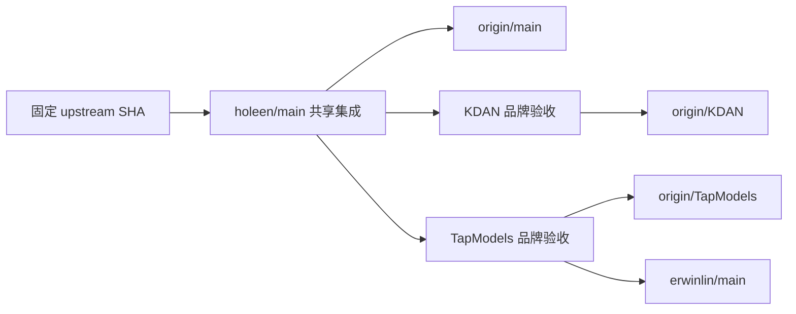

# 项目定制与上游同步流程

整理日期：2026-09-08。适用于公共层、KDAN、TapModels 的需求、代码、多语、品牌和 Bug 维护。
本文件区分已确认需求、当前工具能力和建议改进；建议中的传播拓扑尚未实施，不改变既有分支。
同日五项审查问题已完成修复；提交前验证结果与各分支工作区见审查报告第 6 节，后续发布状态以 Git 引用为准。
当前证据和待修问题见 [定制审查报告](CUSTOMIZATION_REVIEW_2026-09-08.md)。

## 1. 需求边界

| 领域 | 需要保留的行为 | 核心验收 |
| --- | --- | --- |
| 上游同步 | 保留上游新增功能、修复、原始提交及后续 merge 能力 | 固定上游 SHA；最终分支包含该 SHA；新增字段、DTO、构造器、迁移和所有协议入口语义一致 |
| 公共定制 | 共用网关、账号、运维和 keys 能力集中维护 | 一个需求在公共层实现和验证，两个品牌有明确接收记录 |
| 账号兜底 | 最多三次同平台跳转，只借用备用账号容量 | 入口分组计费、订阅/余额扣减和权限不变；粘性/response_id 用实际选号分组；策略拒绝不绕过 |
| 配额与诊断 | 共享窗口与 Fable 专属窗口独立；没有采样不能当零用量 | 限流 CAS、实际恢复时间、混合限流原因、错误体与 Retry-After 分别验证 |
| 账号授权 | 直接导入长期 setup-token 与旧交换短期令牌分开处理 | 重授权清理旧字段；直接导入不误刷新；旧短期令牌仍可续期 |
| 模型同步 | 实时 Anthropic 目录，账号白名单交集、分组候选并集 | 明确部分失败，超时有界，缓存随凭据变更失效；候选不裁掉既有保存项 |
| 模型配置 | Codex 主模型与 review_model 同值；目录跟随管理员顺序 | 精确/通配白名单、大小写、兜底、数组/priority/ETag 一致；保留上游未知能力字段 |
| keys 下载 | 显示、复制、下载同一份文本 | 用真实 TOML/JSON 解析器验证，覆盖站名、路径和转义字符；shell 命令块不伪装成文件 |
| 错误与运维 | 请求体错误分类、上游换号审计、凭据脱敏、任务真实判活 | 客户端出口和持久化均脱敏；HTTP/WS 兄弟路径一致；无流量也可发现后台故障 |
| 三语 | 人工维护 zh、en，由 zh 生成台湾繁中 | 键/插值/关联消息完整；台湾术语、日期数字格式、切换后的响应更新和关键页面验收 |
| 品牌 | 公共层保持通用，KDAN/TapModels 保持各自展示及发布身份 | 站名、Logo、标题、链接、配置片段、镜像和构建 SHA 相符；运行时自定义值优先 |
| 发布 | 被审查代码、构建产物和线上运行身份可对应 | 迁移评估、备份、应用替换、镜像 ID、二进制 SHA、build_commit、健康和回滚材料 |

模型具体能力、价格和第三方接口事实应记录来源与核验日期，不把本地静态目录视为上游实时保证。

## 2. 分支与方向

| 分支/引用 | 职责 | 发布去向 |
| --- | --- | --- |
| `upstream/main`、本地 `main` | 公开原始基线 | 不发布私有定制到 upstream |
| `holeen/main` | 共享定制集成 | `origin/main`；`origin/HEAD` 指向它 |
| `KDAN` | 公共能力加 KDAN 定制 | `origin/KDAN` |
| `TapModels` | 公共能力加 TapModels 定制 | `origin/TapModels` 和 `erwinlin/main` |

已发布历史使用普通 merge；不为整理日常同步而 rebase、squash、force-push。修复未发布提交或用户明确要求历史整理时，另按该次明确范围处理。

### 当前可用流程

`deploy/sync-upstream.sh` 调用个人 `sync-upstream` 技能中的脚本。它分别向三个分支 merge 同一个固定上游 SHA，保存检查点和验证结果；不会自动把公共层的新功能合入品牌。

仅做上游同步准备时，现有命令为：

```bash
./deploy/sync-upstream.sh prepare --all
./deploy/sync-upstream.sh status
```

`prepare` 会修改本地分支并运行验证，不是纯只读预览；本次文档整理没有执行它。`status` 显示保存的证据，不等于重新查过远端。冲突恢复和发布按检查点及本次已有授权执行；现有技能要求新的冲突语义先取得用户选择。

### 建议目标流程

把公共需求的合入方向收敛为下面的结构，以减少同一修复在三个分支重复实现和重复解冲突：



每轮先形成并验证一个固定公共集成 SHA，再分别普通 merge 到两品牌。保留品牌定制和原有历史，避免品牌分支之间互相合并。验收条件是该公共 SHA 为两个品牌 tip 的祖先，而不只是三个分支“都跟上了 upstream”。

迁移到这个拓扑前，需要核对目前两个 merge-base、重复公共修复和品牌差异；不能直接复制整棵公共树覆盖品牌。新工具应记录 `upstream_sha`、`common_sha`、各品牌起止 SHA、冲突决策及每个发布目标结果。现有工具没有这项公共层传播能力，不能用 `--all` 冒充已实施。

## 3. 每项工作的统一步骤

1. **登记需求**：写清触发、当前行为、目标行为、影响分支、数据/协议边界和可观察验收。区分本次要实现的内容与未来建议。
2. **固定基线**：检查工作树、刷新需要的远端，记录完整 SHA、上游差异、公共差异和品牌差异。保留用户及协作者已有修改。
3. **选择归属**：共享逻辑从公共层的短期 `codex/` 分支开始；纯品牌文案、资产、发布目标从对应品牌开始；线上实例参数留在实例配置。
4. **实现与审查**：追踪完整调用链及 HTTP/WS 等兄弟入口。阅读删除和重命名部分，避免只把编译错误修到消失。
5. **生成**：源输入稳定后运行 zh-TW、Ent、Wire 等对应生成器，审查生成差异；不靠手改生成文件维持一致。
6. **验证**：按下一节的风险矩阵选测试。失败先区分代码问题、命令目录/工具链问题和外部环境问题，记录实际结果。
7. **传播与验收**：公共功能按固定公共 SHA 传到两品牌，补品牌特有验收。无法立即传播时登记欠缺项，不能用同名提交表示完成。
8. **发布交付**：根据该次授权执行远端推送或生产部署，分别记录本地验证、远端接收、CI、产物和线上验证状态。

每条需求卡至少保存：`ID`、业务目标、影响分支、源码入口、协议/数据约束、验收用例、关联提交、已验证 SHA、剩余风险和发布状态。不要让需求文档只由易失效的“第几个提交”命名。

## 4. 上游新增与冲突处理

同步前先列出新增功能、删除/重命名、迁移、依赖变化以及双方都修改的文件。重点检查以下交叉点：

| 上游变化 | 要额外核对的本地定制 |
| --- | --- |
| 调度、分组、权限、费用字段 | 原分组计费与备用选号分离；新策略不能被旧提前返回绕过 |
| models/manifest、白名单、缓存 | 精确与通配匹配统一；排序、priority、ETag 和能力元数据一起验证 |
| 构造器、接口、DTO、缓存投影 | Wire/Ent 生成；新字段在读取、更新、复制和缓存失效路径都有对应处理 |
| 错误响应与新协议入口 | 错误分类、换号耗尽映射、脱敏和审计共享规则都接入 |
| zh/en 文案或页面 | 补齐新键和台湾词典；重新生成 zh-TW，检查模板与脚本字面量 |
| 后端中文匹配表达式 | 外部协议值及历史数据匹配不翻译；转换后生产者/匹配者成对验证 |
| 构建、部署、更新功能 | 品牌镜像/二进制入口、release 源、现有卷/数据库及应用名兼容 |

冲突记录包括双方原有行为、直接选任一侧会丢失什么、融合后的行为以及验证证据。机器生成冲突先解决其源输入，再重生成。不能通过整文件 ours/theirs、跳过提交或删除测试掩盖差异。

## 5. 多语维护

前端的真源是 `frontend/src/i18n/locales/zh` 与 `en`。改台湾用语时优先改 `tools/zh-tw/convert.mjs`；句子级特殊修正放在生成器的覆盖规则。`zh-TW` 目录和繁中合规 Markdown 都是生成物。

建议按顺序执行：

1. 实现页面时同时补 zh/en 文案、插值、复数及动态标签；不再引入 `labelZh/labelEn` 或 `locale === 'zh'` 二分逻辑。
2. 运行 `node tools/zh-tw/gen-locale.mjs`，审阅台湾术语及品牌覆盖。
3. 运行 `gen-locale.mjs --check`、消息编译、键集合/插值/linked message 检查及硬编码扫描。
4. 对新增交互验证三语切换，重点看图表、表格、弹窗、CSV、说明与下载内容；新增页面同时检查桌面和手机布局。
5. 用户自定义站名、公告、分组名、邮件正文及上游日志保持原始内容，不因切换语言而重写持久化数据。

日期/数字/中文判断统一复用 `localeUtils`。linked message 中的标点使用合法语法；运行时站名在消息系统中当作数据，在 TOML 等文件中按目标格式转义。

后端目前是构建时繁中转换，不是按请求动态选择三语。短期先补转换后关键契约测试，尤其支付返回值、历史日志识别、拒绝原因和确认短语。中期可按用户可见接口逐步引入稳定错误码/参数，再由 UI 翻译；避免一次性改写整个后端。

## 6. 品牌策略

将品牌需求分为三类，防止品牌替换侵入协议或存储：

| 类别 | 归属 | 例子 |
| --- | --- | --- |
| 共享能力 | 公共层 | 网关、模型排序、错误分类、语言生成、通用首页组件 |
| 品牌默认值 | 品牌层 | `brand.ts` / `brand.go`、Logo、默认站名/标语、文档链接、镜像与 release 仓库 |
| 实例配置 | 运行环境/数据库 | 管理员自定义站名、域名、公告、数据库连接、现有卷名、代理和开关 |

保留既有 Go module、API 路径、请求头、Redis/localStorage 命名空间和插件契约，除非另有兼容迁移任务。新装模板可以有品牌服务名，但不能直接覆盖在用部署的数据库、卷、网络和 Compose 服务键。

每次品牌验收至少核对首次打开、设置加载后、三语切换后、登录/首页/后台标题、配置下载、文档链接和版本弹层。版本号、上游基线和实际 `build_commit` 分别表达不同信息；缓存 release 数据不能覆盖当前二进制身份。

品牌常量暂时继续使用现有文件结构。先统一零散的硬编码和验收矩阵；只有同一数据在多个构建入口反复漂移时，再考虑生成一个不含敏感值的品牌清单，避免提前引入大型品牌框架。

## 7. Bug 修复与测试矩阵

Bug 记录采用“触发输入 -> 实际输出 -> 预期输出 -> 根因 -> 回归用例”。现有测试通过不代表跨功能组合正确，本轮通配排序和 Fable 诊断正是这种情况。

| 改动类型 | 最低检查 | 需要扩大的条件 |
| --- | --- | --- |
| 纯文档 | 链接、命令、SHA、当前/历史状态核对 | 文档包含可执行发布步骤时同时核对真实入口 |
| 前端文案/品牌 | 生成检查、相关组件测试、类型检查 | 共享 i18n/router/store 或模板生成器变化时跑全量前端测试和构建 |
| 普通页面交互 | 相关视图/API 测试、类型检查、lint、构建 | 新用户流程或响应式变化需要浏览器验证 |
| 调度/计费/错误协议 | 相关 service/handler/repository 测试 | 共享网关、权限、并发、缓存变化时扩到全后端 unit/vet；并发变更加定点 race |
| 数据模型/迁移 | 生成一致性、迁移静态检查 | 新旧 schema 兼容、真实 PostgreSQL 集成和备份恢复验证 |
| 构建/发布 | 品牌打包测试、tag 分类、入口及版本元数据 | 新镜像路径或转换方式需实际构建并验证最终二进制 |

本机 Node 在 `~/sdk/node/bin`；前端测试从 `frontend/` 运行现有 `node_modules/.bin/vitest`。Go 使用本机已安装且与仓库要求匹配的 SDK。测试命令、目录、标签和结果均写入记录。

当前 CI 的 `make test-frontend` 实际只跑 lint、typecheck 和关键测试子集；全量 Vitest 是另一种覆盖范围。当前转换器 CI 只 dry-run，不能代替转换后应用行为测试。优化 CI 时应按上述矩阵补足，而不是把所有检查都无条件跑三遍。

共享 Bug 首先修公共层，再传播到两个品牌；若紧急故障先修品牌，需登记公共层回补和另一品牌接收状态。已经共享的历史默认追加修复提交，不再为日常 Bug 重写历史。

## 8. 发布边界

代码同步、远端推送、镜像发布、生产部署是不同阶段。品牌分支推送可能自动构建并推送 GHCR，但工作流本身不部署生产；本地 `prepare` 成功也不意味着远端或线上完成。

现有目标：KDAN 镜像 `ghcr.io/holeenlu/kdan`，TapModels 镜像 `ghcr.io/erwinlin/tapmodels`。本地已修复 R1，正式/预发布由共享 SemVer 判定；只有正式版本提升 `latest`。远端发布修复后，该规则才会进入实际镜像发布链。

本机 `deploy/release.sh` 已支持当前检出分支或显式 `--branch`；它读取固定生产目标 `45.78.66.2`。发布时必须在交付记录明确写出品牌、目标分支和站点，不能让碰巧检出的 TapModels 自动代表 KDAN 生产目标。生产既有数据和依赖状态以现场配置为准。

发布记录保留目标 SHA、公共/上游基线、变更与迁移影响、备份及恢复校验、构建参数、镜像 digest/ID、二进制 SHA、实际 `build_commit`、本地/公网检查和回滚材料。应用更新保留现有数据库、Redis、卷和生产参数。同步授权不自动扩大成部署授权；已有明确授权也不重复索取。

## 9. 近期改进顺序

| 顺序 | 工作 | 完成标准 |
| --- | --- | --- |
| 1 | R1-R4 已完成修复与验证 | 正式/预发布隔离；特殊站名 TOML 可解析；通配目录顺序一致；不输出未经全链证明的精确 Fable 归因 |
| 2 | R5 说明、issue 模板及旧入口已修正 | 共享指令生成器只输出普通 merge 流程；已存在的远端 issue 尚未修改 |
| 3 | 建立公共修复传播记录，并确定目标拓扑 | 每个品牌明确包含哪个公共 SHA；迁移后可用祖先关系验证，兼顾品牌差异 |
| 4 | 整理需求索引和历史报告 | 区分提案/已实现/已验证/已发布；更新旧 SHA、未提交声明和冲突需求 |
| 5 | 补转换后契约及发布门禁 | 测试实际转换产物、预发布 tag 与错误输入，而不只检查源码字符串 |
| 6 | 让协作流程可随仓库恢复 | 非敏感工具与规范可版本化；个人路径、凭据、主机配置留本地；新工作站有明确安装检查 |

工具协作默认由当前主代理直接执行，本文件不新增模型绑定或强制子代理约定。当前用户指令优先于旧记忆；要用子代理时以用户明确要求为依据。
