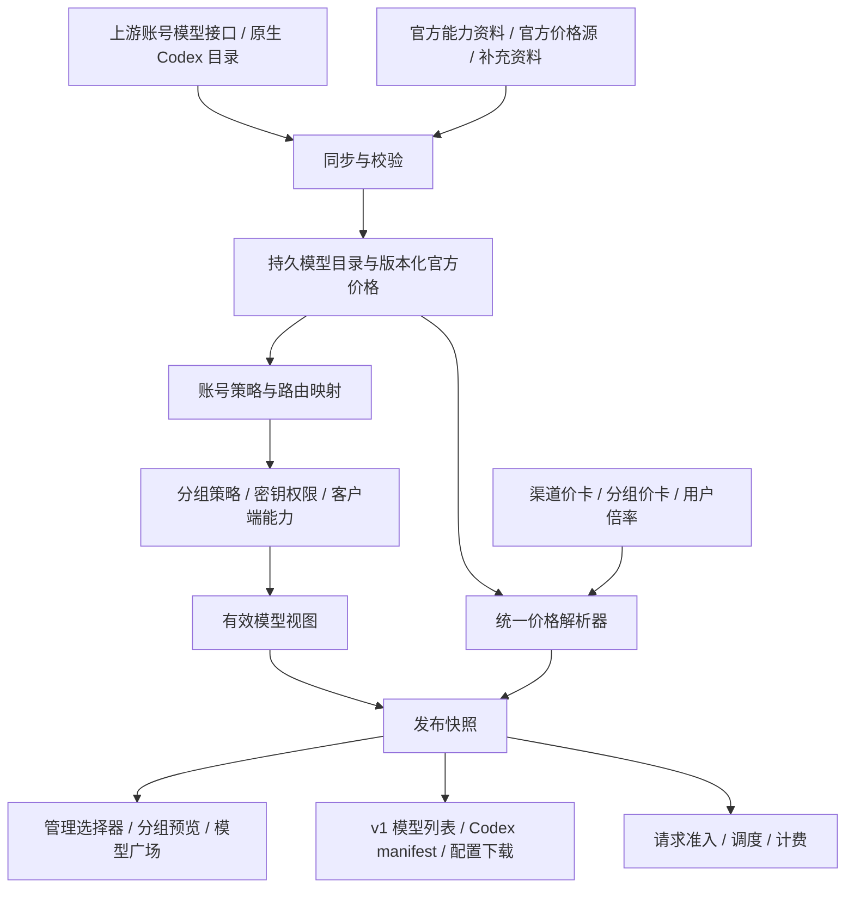

# 模型与价格统一管理设计

状态：设计已落地；实现、兼容取舍及本机验证见 [verification.md](verification.md)。运行参数仍需按生产账号规模和上游限制校准。

审查基线：`b229f0f722bc521261e131fa05e4cac256997c57`，2026-09-30。工作目录内其他任务的暂存代码不属于本次规划。

## 1. 目标与边界

推荐建立统一的模型目录和独立价格中心，五个页面只负责各自的配置或展示。统一的是模型身份、证据和计算规则，并非要求不同用户、账号或客户端看到完全相同的列表。

对已接入的 Responses、Chat Completions、Messages、Gemini、图片等协议，新模型满足“账号可访问、协议匹配、必要能力明确、计费可解析、开放策略允许”后自动上线，不再要求修改模型枚举、名称判断、提示词或价格常量并发版。

“第一时间”的计时起点是模型及必要资料对本站使用的上游账号实际可见。公开发布公告不保证每个订阅、地区或 API 账号同时获得权限。建议常用来源每 5 分钟同步，重点来源可设 1 分钟；资料齐备后在一个同步周期内发布。价格源或账号权限尚未开放时，显示具体待就绪原因，不给出虚假的可用承诺。

1～5 分钟是模型列表的发现目标。端到端上线时间还受能力、价格来源中最慢一项及重试影响，必须分别度量，不能把发现周期当成所有新型号的可用时限。

新增协议、认证流程、计量维度或客户端无法表达的新能力，仍需要协议适配。此目标是取消逐型号发版，不是取消所有适配工作。

## 2. 当前链路及问题

以下依据来自上述代码基线；是实现行为审查，不是生产数据库实测。

| 位置 | 当前实现 | 问题与处理方向 |
|---|---|---|
| 账号同步 | `service/upstream_models.go: SyncUpstreamModelCatalog` 读取上游、补 models.dev、向 `accounts.extra.upstream_model_metadata` 保存完整型号 | ID、能力和原始 manifest 没有一起进入同一持久目录；部分资料只因字段不完整便无法形成完整记录。保留部分事实，逐字段标记状态 |
| 账号选择器 | `handler/admin/account_handler.go: GetAvailableModels` 的部分平台路径仍返回内置模型或映射键 | 表单候选和上游可访问模型不是同一个概念；选择器应改为统一目录加已保存的管理员条目 |
| 账号白名单 | `Account.GetModelMapping` 与 `useModelWhitelist.ts` 将白名单保存为身份映射，别名也存在 `credentials.model_mapping` | “允许使用”与“改写名称”混在一个字段里；新增上游型号不会自动突破固定白名单，需显式跟随策略 |
| 分组目录 | `service/group_model_catalog.go` 已汇总发现快照、账号/渠道映射、路由和分组白名单，并排除纯定价条目 | 保留这个方向，将其升级为统一策略解析器，不另写一套相同职责的服务 |
| 发现快照 | `service/group_model_snapshot.go` 使用进程内 `catalogSnapshots`，有账号/凭证修订检查和 24 小时期限 | 重启、实例间不同步及其他同步入口未写此快照，会影响目录。增加持久层，保留修订隔离 |
| 固定账号 | `openai_codex_models_pinned.go` 获取选定账号目录，重复 slug 以配置顺序先见者为准 | 来源选择、模型并集、能力取值需要分别表达；同名模型不能直接用首个账号能力覆盖其他账号 |
| Codex 获取 | `handler/openai_codex_models_handler.go` 非固定模式下可由本地映射生成并提前返回 | 点“获取目录”未必更新上游资料；应统一读发布版本，刷新按钮显式调度同步 |
| Codex 模板 | `openai_codex_models_service.go`、`openai_model_alias.go`、`pkg/openai/constants.go` 含型号识别与能力/提示词默认值 | 新型号可能套旧模板或无法声明能力。改为协议适配器加可更新的模型资料，避免逐型号代码分支 |
| `/keys` 默认模型 | `UseKeyModal.vue` 使用 `OPENAI_MODEL_PRESETS` 和前端排名选默认值 | 内置候选不等于该密钥权限；配置所选模型必须来自其有效目录，推荐顺序使用数据配置 |
| 渠道同步按钮 | `ChannelHandler.SyncPricingModels` 返回 LiteLLM 价格目录中的名称 | 实际是“导入价格目录候选”，不是账号模型发现；按钮和 API 语义应分开 |
| 渠道列表 | `Channel.SupportedModels`、`ChannelService.ListAvailable` 仍以映射与定价并集生成部分展示；`RestrictModels` 会把价格表当白名单 | 与共享分组目录口径不同。定价不创造模型支持；旧价格限制需显式迁移，不能直接移除 |
| 价格解析 | `ModelPricingResolver` 已有分组→渠道→目录/兜底链；`PricingService` 已支持远端哈希与本地文件热重载 | 复用解析器与热重载；补齐字段来源、显式零值、版本和数据化型号规则 |
| 广场官方价 | `ModelPlazaService.lookupOfficialPricing` 通过 `BillingService.GetModelPricing` 读取 | 虽不乘组倍率，但其底层目录会合并 fallback/override 和型号策略；未独立保留原始官方价，存在自定义价被当成官方价展示的风险 |

标准 OpenAI 模型列表主要给出 ID、所有者等基础信息，不承诺能力和价格齐全，详见 [OpenAI Models API](https://developers.openai.com/api/reference/resources/models/methods/list)。各平台要按自己的模型接口解析：例如 [Claude Models API](https://platform.claude.com/docs/en/api/models/list) 包含能力、上下文及分页字段，[Gemini Models API](https://ai.google.dev/api/models) 包含生成方法和 token 限制。不能用同一个最小 ID 提取器丢弃这些资料。

## 3. 推荐架构

实现为现有 Go 应用内模块，数据库持久化、Redis 共享缓存和失效通知。外部服务失败不会让每个页面和每个请求都同步访问厂商。

职责分为四层：

1. **事实层**：上游发布了什么，该凭证能看到什么，该模型支持什么，以及各类来源的报价。
2. **策略层**：管理员允许哪些模型、怎样映射、按什么价格销售；同步不能覆盖这些决定。
3. **解析层**：在具体分组、账号、密钥、协议和请求条件下，计算可服务模型、能力和价格。
4. **展示层**：按使用场景输出列表、配置和价目；不再分别猜测模型或重算价格。

## 4. 模型身份、证据和就绪状态

### 4.1 身份及路由

模型 ID 按上游原样保存，不能全局按名称前缀猜厂商、把所有 ID 转小写、剥版本号或将未知 GPT 型号映射到旧型号。厂商明确支持的别名与大小写归一化由对应适配器处理。

至少区分以下字段：

| 字段 | 含义 |
|---|---|
| `provider_id` / `upstream_namespace` | 模型厂商和具体供给方；官方 OpenAI 与某个兼容中转不是同一证据来源 |
| `native_model_id` | 供给方接受的原始模型 ID |
| `account_scope` | 凭证主体、组织/项目、认证类型、区域等访问范围 |
| `protocol_profile` | 已实现的协议与版本；Responses、Chat、Messages、图片生成、图片编辑分别判断 |
| `public_model_id` | 用户请求的名称，可是运营别名 |
| `channel_model_id` / `upstream_model_id` | 渠道映射后名称、账号实际出站名称 |
| `response_model_id` / `billing_model_id` | 上游报告的模型、按已配置规则选择的计费身份 |

按当前路由顺序建立明确的一次性映射链：公开模型的分组权限 → 渠道映射 → 账号限制和映射 → 实际出站模型。目录投影和网关复用该链，避免列表按一个名字放行、请求按另一个名字拒绝。

两个账号使用相同 ID，不代表具备相同能力、区域权限、上下文上限或价格。发现模型取可服务账号的并集；某项能力只能由支持它的账号承接。若暂不能按能力筛选调度，面向客户端先公布实际候选账号的能力交集，不能公布并集后随机分配到不支持的账号。

### 4.2 按字段记录资料

每个能力字段保存 `value`、`state`、`source_kind`、`source_revision`、`observed_at`、`expires_at` 和可选覆盖锁。缺失、未知、明确不支持是不同状态；`false`、`0`、空列表是否有效由字段合同决定，不能用真假值统一当成缺失。

能力包括输入/输出模态、协议端点、推理是否可配置、推理档位与默认值、上下文/最大输出、函数工具、搜索、图片工具、原生 Codex 字段及默认指令。保留原始资料以便追溯，导出只发送对应客户端允许的字段。

来源建议：同一供给方与访问范围的原生返回优先；缺失字段依次参考官方同型号资料、受信且可热更新的数据包、models.dev 等补充资料和同范围历史成功快照。管理员明确覆盖单独叠加并标识；不得靠覆盖宣称超出网关协议适配器本身的能力。第三方资料不能证明某个账号有权限，也不能覆盖上游明确的能力限制。

不把 GPT-6.1 Sol 的描述、推理档位或提示词直接复制给下一个新 ID。原生 Codex manifest 的模型指令有明确来源时保留；缺少专用指令时使用声明为兼容用途的通用编码指令，避免冒充某一旧型号。没有足够资料满足 Codex 必需字段时，该模型可在普通 API 目录中按其协议状态展示，但不输出一份伪造完整的 Codex 配置。

### 4.3 分别判断就绪

保存独立状态，不用一个 `supported` 布尔值表达所有情况：

- 已发现、资料待补齐、数据过期、官方停用。
- 账号可见/不可见、管理员允许/禁止。
- 按协议可路由、客户端合同是否满足、价格是否可解析。
- 实际调用已验证/未验证，以及实时限流、过载、余额和故障状态。

“上游模型接口已返回”与“已执行真实调用成功”必须分开。自动发现默认不批量发送收费推理探测；有需要的分组可显式启用有预算上限的验证任务。

临时 429 或过载不删除模型定义；公开页面可显示暂不可用，运行时仍按健康状态调度。账号停用、解绑、凭证撤销、分组或密钥权限收紧应立即失效，不能以保留旧快照为由继续放行。

## 5. 五个页面的职责

| 页面 | 推荐行为 | 取消或兼容的旧行为 |
|---|---|---|
| `/admin/accounts` 模型限制 | 展示该账号发现的模型、资料状态和更新时间。提供“跟随上游＋排除列表”“固定允许列表”，账号别名映射单独编辑；同步只更新资料 | 不再把“同步上游”当成覆盖已保存白名单；未保存的表单变更不丢失；批量限制必须显示各账号差异 |
| `/admin/groups` 模型白名单 | 基于成员账号和路由的有效并集配置开放范围，提供自动跟随、固定列表；显示新模型被哪个规则排除 | 不再使用价格目录充当授权候选；同名异平台或不同端点分别显示 |
| `/admin/groups` 固定账号 | 归入“模型发现来源”：全部成员账号 / 指定账号；保留原账号顺序和回退策略，模型并集与能力合并分别处理 | 固定账号决定目录资料从哪里取得，不隐式改业务调度；失败不默默扩大来源范围 |
| `/admin/groups` 逐模型定价 | 保留为本分组销售价格覆盖，明确精确/通配规则、继承字段和最终倍率。选择器读取有效模型视图 | 配置一个价卡不自动创建或授权一个模型 |
| `/keys` 使用密钥 | 使用密钥自身的有效快照生成配置。密钥列表响应携带或关联预计算的 setup profile，弹窗不等上游；默认模型从该 Key 允许且适合客户端的模型中选 | 不用本地固定数组当作密钥权限；不同 Key 的目录不可互相复用；获取目录与下载文件分开 |
| `/admin/channels/pricing` 映射 | 只负责渠道公开名到目标名的映射；默认同名转发，新模型无需再添加 `A→A` | 保留旧身份映射兼容，迁移为明确的策略，不擅自删掉依赖它的限制 |
| `/admin/channels/pricing` 定价 | 展示继承的官方参考价和本站价，仅保存自定义覆盖。将“同步模型”拆为模型发现与价格资料刷新 | 不再往渠道持久化复制整份官方价格，否则复制值会阻止后续自动涨降价 |
| `/model-plaza` | 展示当前用户可见的分组模型及统一报价，明确请求模型、能力、倍率、价格单位、条件和资料版本 | 不以价卡条目生成额外模型；不把缓存失败表现为免费；不在浏览器重复乘倍率 |

增加统一管理入口，建议位于“系统设置 → 模型与价格同步”，集中配置数据源、同步频率、最新状态、待补字段、异常变更和回滚版本。可另设管理详情页 `/admin/model-catalog`；正式路由在实施阶段确定，避免在五处再各加独立配置。

“最强默认模型”不能只按数字版本或名称后缀判断。采用可热更新的推荐级别/顺序，管理员可覆盖；只在当前 Key 的合格模型中选择。新型号未有推荐依据时保持当前可用默认值，用户仍可手动选择新型号；现有会话不因模型列表刷新而换模型。

## 6. 发现与自动开放

### 6.1 两种策略，避免重复维护

账号和分组均提供：

- **跟随上游**：已有白名单规则仍生效，可设置排除项；新模型达到发布条件后自动加入。
- **固定列表**：只开放管理员明确选定的模型，新增发现只提示不自动放行。

建议对需要快速接入新模型的分组选用“跟随上游＋就绪校验”。自动公开需要同时满足账号与分组策略；任何一层固定列表都不能被同步覆盖。存量固定白名单迁移后仍固定，管理员一次性切换为跟随后，新模型才不需要逐个勾选。

必须支持所有开关组合：关闭限制、开启且空列表、通配、显式排除、身份映射、普通别名及透传。空列表行为由模式确定，不把空列表同时解释为“禁止全部”和“允许全部”。存量语义通过兼容模式保留。

### 6.2 同步任务

| 对象 | 建议默认 | 特殊触发 |
|---|---|---|
| 上游账号模型及原生能力 | 5 分钟；重点来源 1 分钟 | 新账号、重新授权、管理员手动刷新 |
| 独立能力补充资料 | 15～60 分钟 | 发现新 ID 或原生字段变化时优先刷新，避免等完整 TTL |
| 官方价格资料 | 5～15 分钟，以来源能力和限额为准 | 新 ID、价格修订、生效时间到达 |
| 分组/密钥投影 | 本地按修订即时重算与失效 | 账号绑定、限制、映射、价卡和倍率变更 |
| 客户端本地目录 | 启动前同步或用户主动更新 | 不宣称正在运行的客户端必定支持热加载 |

价格已有远程同步与文件热重载，优先扩展这一机制。JSON 数据包版本发布和服务程序发版解耦；新增模型资料不再需要重新编译。没有稳定结构化官方价格源时，允许经过核实的数据包通过管理接口或数据文件更新；网页变动无法可靠解析时保留旧版并报告，不自动猜价。

按凭证主体和实际发现范围去重；父子/影子账号仅在源身份一致时共享上游获取，随后各自应用策略。不能只按域名复用权限目录，也不能因为账号 API Key 看起来同厂商而合并。

实现单任务合并、分布式租约、并发上限、超时、指数退避和随机错峰，遵守 Retry-After。手动刷新优先排队并复用进行中的任务；普通用户获取目录不能对所有账号无界触发上游请求。

### 6.3 快照发布和错误处理

1. 先完整获取和校验原始响应，处理分页，再写候选快照。
2. 分别更新模型可见性、能力与价格；单个新模型资料不完整时，仅令它待补齐，保留其他有效条目。
3. 生成发布修订，固定目录、能力、价格和策略的组合版本；原子切换当前指针并通知其他实例。
4. 按主体和分组重新投影，客户端用最终内容 ETag 获取变化。

网络错误、429、5xx、无效 JSON、部分分页失败：保留上次有效资料并标识过期；不能将失败写成成功空目录。完整、合法的空列表或明确权限撤销则是有效否定事实：停止把该账号视为相应模型的可用来源，历史资料仅供审计。大规模删除或极端价格变化进入异常检查，检查期间也不能把已明确撤销的权限恢复成可用。

来源部分失败时保留各来源独立状态，不以一个失败结果清空整个分组。重启及多实例读到同一持久快照。缓存键必须包含来源范围、账号凭证修订、分组策略修订、映射版本、客户端协议版本及需要个性化报价时的用户身份/倍率修订；鉴权先于 304 判断。

## 7. 价格来源与结算

### 7.1 三种价格分开

| 价格 | 来源与用途 | 更新约束 |
|---|---|---|
| 官方参考价 | 对应厂商、型号、区域、服务档、单位的公开标准价 | 保留来源与生效版本；不乘本站倍率，不叠加管理员销售价 |
| 本站销售价 | 分组/渠道价卡、销售默认规则及个人/分组/媒体倍率 | 人工覆盖有锁；未覆盖字段继续继承；不被上游同步覆盖 |
| 实际采购成本 | 账号供应商费率、合同优惠、账号成本倍率或上游账单探测 | 只服务成本核算和利润分析，不自动回写前两类价格 |

LiteLLM、models.dev 是补充来源，不应无条件标成厂商官方资料。已核实的官方记录可显示“官方价格”；未核实的社区参考或渠道报价应标明来源，官方价未知时保留为空，不能借用名称相似模型的价格。

### 7.2 统一解析规则

请求计费身份沿用配置的 `requested`、`channel_mapped`、`upstream` 或 `response_model`，必须能解释实际选择。解析按字段执行：

`分组显式覆盖 → 渠道显式覆盖 → 站点显式默认规则（如已配置）→ 同型号有效官方价`

精确规则优先于匹配范围更窄的通配规则，再到更广的默认；同优先级冲突应显式报出，不能依赖无说明的数组位置或 map 遍历顺序。旧规则优先级在迁移兼容阶段保持，差异先进入预览。

区分“未设置，继承”“设置为 0，免费”“设置正值”“该维度不适用”。GPT-6.1 Sol 等已有明确官方规则的缓存写入价，可以通过带来源的型号资料补缺；不能把这种规则套给所有未来型号。显式零价和管理员非零价均不能被兜底替换。

对同一使用量维度：`实付 = 使用量 × 有效单价 × 生效倍率 × 适用条件倍率`。个人倍率优先于组倍率，两者不连乘；图片/视频独立倍率开启时按原规则替代组倍率。Fast/Flex、推理档位、分时和长上下文由同一解析器处理；阶梯已输出绝对单价时不再重复乘同一条件。

单位必须显式：每 token/百万 token、每图、每秒、每次请求、工具调用分别表示。文本与图像输入、输出、缓存、缓存写入时长、区域、质量/分辨率和整单/边际阶梯均作为价格维度。内部保持足够精度，单位换算集中处理，前端只格式化。

定价缺失的新模型可先进入管理目录，销售发布标为待定价；允许使用的前提是已有完整官方价或管理员显式通配/统一价规则。不能用最相近旧型号替代，也不能把缺失当作 0 直接收费。

### 7.3 与真实请求一致

报价、预览和网关计费调用同一个价格解析器。请求接纳时绑定价格修订和条件规则，流结束时以最终用量计算；中途上游涨降价或后台编辑不重算已接纳请求的价卡。使用记录保留价格修订、规则来源及使用的倍率。

多个路由的最终销售价不同，展示明确范围/分支条件，或由运营设置一致的公开销售价；不能随便挑一个账号冒充统一价格。`response_model` 模式以受信的响应模型在已固定价格版本内解析；响应报告一个事前无法定价的未知模型时记录待核算，不默认免费、不猜模型、不重放已执行生成。自动开放应有明确的未知响应计费处置策略。

## 8. Codex 客户端闭环

服务端目录更新、网页下载、本机文件落盘和客户端重载是四个步骤。官方将 `model_catalog_json` 定义为启动时读取的 JSON 路径，见 [Codex 配置文档](https://learn.chatgpt.com/docs/config-file/config-reference)。

推荐保留稳定的本地目录路径，并提供两条使用方式：

1. 当前兼容路径：获取最新已发布目录 → 下载 → 用户覆盖本地文件 → 重启客户端。界面显示导出版本、时间和缺失项。
2. 可选便捷路径：提供用户主动安装的本地更新命令或启动包装器；使用本机已有 Key 请求专用目录接口，检查状态码、manifest 合同、当前默认模型与权限范围，先写临时文件，再原子替换。失败保留原文件；更新器只更新目录，不重新写整份 config、认证文件、插件设置或会话数据库。

新会话默认模型可以按分组推荐策略更新；更新器不静默改现有会话或删除当前默认模型。若该模型已被撤销，明确提示选择替代，不把它强行加回无权限目录。

支持在线获取目录的客户端版本，可优先验证原生目录请求；只有完成具体 Desktop/CLI 版本的兼容测试后才改变默认交付方式。不能把 `model_catalog_json` 改成 HTTP URL，也不能假设服务器能直接写用户的 `~/.codex`。

配置生成由一份 setup profile 同时产生 `model`、`review_model`、推理配置、目录路径和认证模式。目录不包含 API Key。Legacy 模式所需的认证文件和直接 API Key 模式要分开说明；不得将 Desktop 登录窗口直接归因于模型目录，更不能仅因名称大小写就批量更换现有 Provider ID。

## 9. 292 票据与其他消费者

票据中心也应从账号有效模型目录取得候选，再叠加“是否适用票据”“是否有指纹资料”“是否参与打票”“是否有有效票据”等状态。ModelTrace 指纹库是票据验证能力来源，不是全项目的模型发布总表。

新型号没有指纹时可显示“指纹资料待更新”，不伪造验证成功，也不把账号白名单中的新型号无说明地隐藏。普通使用能否继续应遵从原有账号/模型无票策略；本次目录统一不自动放松严格票据策略。

首页前六项、账号测试、模型映射候选、批量白名单、可用渠道列表、诊断模型选择也应接入相同模型视图，避免五个主页面统一后旁路继续使用静态列表。

## 10. 最小数据与服务调整

建议新增下列持久实体，具体表名可在实施时按项目惯例调整；销售覆盖和账号限制优先复用现有结构。

| 实体 | 关键内容 |
|---|---|
| `model_catalog_sources` | 来源类型、关联账号/凭证主体引用、协议、访问范围、同步策略；不复制明文密钥 |
| `model_catalog_snapshots` | 来源修订、完整/失败状态、规范化响应、获取时间、内容哈希、错误类别；保留可回滚版本 |
| `model_catalog_entries` | 型号及源范围、能力字段与证据、账号可见性、就绪原因；独立于用户授权 |
| `official_price_versions` | 官方/补充来源、货币单位、各维度价格、发布时间与生效时间、是否核实 |
| `model_catalog_releases` | 发布版本引用的目录、能力、价格版本及校验结果；当前版本指针 |

已有模块演进：`AccountTestService` 的模型发现抽为可复用同步入口；`GroupModelCatalogService` 承担有效模型解析；`ModelPricingResolver`/`QuotePlazaModel` 统一价格；Codex 导出负责客户端投影。能力适配器保留显式协议合同，不加载远端可执行代码。

API 建议：保留现有业务接口，增加管理端来源刷新任务、任务状态、变更预览和模型解释接口。所有普通列表请求读取已发布状态；显式刷新返回任务 ID、旧版本和进度，不能长时间阻塞打开弹窗。

模型解释至少返回：来源、账号可见性、账号/分组限制命中、映射链、可用端点、能力缺失、定价来源和发布状态。用户视图不包含内部账号凭证或隐藏分组；详细解释仅管理员可用。

## 11. 实施、迁移和回退

| 阶段 | 交付 | 完成标准 |
|---|---|---|
| P0 口径冻结 | 固定当前输出样本、策略和计费优先级，提供差异预览 | 能解释每个现有模型为什么出现、为什么缺失、按什么价收费 |
| P1 数据底座 | 持久快照、来源范围、分页适配、字段证据与独立官方价 | 重启/多实例结果一致，新 ID 和部分能力可独立保存 |
| P2 统一解析 | 账号/组策略、路由、报价与全部页面消费者接入 | 同身份、同版本输出一致；不同身份只差授权/条件投影 |
| P3 动态接入 | 移除型号硬编码依赖，完善 Codex 投影和客户端更新流程 | 未写进源码的测试型号完成发现、导出、转发和正确结算 |
| P4 自动发布 | 一次配置跟随策略，定时同步、异常处理、版本发布/回退、运行指标 | 在约定同步周期内接入已就绪新模型，故障可解释且不覆盖人工设置 |

采用逐分组切换：先并行计算旧/新目录与报价，记录差异而不影响服务；再测试组、内部组、品牌生产组逐步启用。保留原价卡、白名单、映射和旧结果用于回退，切换新解析器前不删除旧字段。

现有身份映射拆分为允许项与同名转发；非身份映射保留别名。`RestrictModels` 迁移为等价的权限限制/兼容规则，不能在移除价格耦合时意外开放额外模型。空限制、透传、固定账号并集/回退、复合分组与大小写行为逐项对账。

回滚以新请求的发布指针和分组开关为单位；已执行请求继续使用其价格版本，不能改写历史账单。来源凭证撤销和管理员拒绝始终高于历史版本，回滚不能恢复已撤销的访问权限。

新增数据库迁移属于首次实施交付，上线前需验证迁移与旧版本兼容；此规划不执行迁移或部署。共享功能在 `main` 验证后普通 merge 到 `TapModels`，品牌覆盖保留。

## 12. 验收与可观测性

必须用源码从未出现过的虚构模型 ID 做完整链路测试，避免“又补一个名单”通过验收：模拟上游增项，不改代码、不重启服务；资料与价格齐备后，管理列表、分组授权、Key 目录、广场、实际出站和计费全部一致。

同样覆盖：既有型号能力修订、精确与通配覆盖、两个账号同名能力不同、固定来源部分失败、分页不完整、合法空目录、403/429、价格延迟、缓存重启、跨实例、个人零倍率、显式零价、长上下文与媒体单位、跨密钥缓存隔离、客户端旧目录更新及版本回滚。

运行面板显示来源最后成功时间、同步延迟、候选/已发布/待资料/待定价数量、错误分类、目录版本、价格生效版本和各页面版本差异。新模型上线耗时分解为“上游可见 → 资料齐全 → 允许发布 → 客户端加载”，避免把客户端未更新误判为服务器没同步。

没有可审计的官方资料时显示未知，不用模型名称推断完整能力；实际付费连通性验证在受控账号与预算下单独执行。静态审查和 mock 测试不等于已验证生产账号权限。

## 13. 账号同步按钮与图片模型补充核查

### 13.1 已确认的保存语义

“同步最新支持模型”对应 `ModelWhitelistSelector.vue: fillRelated`，从 `getModelsByPlatform` 读取程序内置数组。OpenAI 来自 `frontend/src/config/openaiModels.ts`。它不请求上游，只向当前表单已选模型追加条目，也不能证明账号具有这些权限。

“同步上游支持的模型”调用 `/admin/accounts/:id/models/sync-upstream`。已有账号按数据库中已保存的凭据和地址获取，不使用尚未提交的表单凭据；创建流程另有 preview 接口。API Key 使用账号的标准上游模型接口，OpenAI OAuth 使用 `https://chatgpt.com/backend-api/codex/models`。

同步返回的 ID 追加到当前表单，不自动删除已有选择；白名单需要保存/更新账号后才写入 `credentials.model_mapping`。但是已有账号的完整能力资料可能在同步请求内就写入 `accounts.extra.upstream_model_metadata`，不等待表单保存。models.dev 在这条路径中补全已发现/已配置型号的能力，并不把整个第三方库作为账号可见列表导入。

下拉候选 `availableOptions` 仍主要来自内置数组；上游新 ID 被加进已选标签，不等于它已经成为持久化的下拉候选。这也是需要统一目录的具体原因。

建议保留“已发现快照”和“管理员允许规则”两类持久数据。内置资料仅作为有来源标记的离线候选，正常更新走服务端资料。统一按钮为“刷新模型资料”，刷新后给出增量和来源；固定模式由管理员应用到白名单并保存，跟随模式按已保存策略自动接纳合格增项。

后续重点澄清：过期预置数组必须退出正常候选与批量填充路径。这里的离线资料只可用于明确标记的历史参考/迁移；不能在同步失败时再次作为“最新模型”加入表单。具体替换要求见第 14 节。

### 13.2 图片 ID 缺失与能力未保存是不同问题

现有标准模型 ID 解析器不会按 `gpt-image-*` 前缀删除条目。如果 API Key 上游实际返回图片模型，这条解析路径会保留 ID。若没有出现，应先核对实际账号类型、查询端点及原始返回，而不是直接断言解析器过滤了图片。

OAuth 路径读取 Codex 会话目录，该目录不构成完整媒体模型发现接口。不在会话目录中，不等于该账号一定无法通过本站图片桥接链路使用它，也不等于一定已经获权。不能将订阅凭据直接拿去调用 Platform API 模型列表并期待两种权限相同。

另有一个已确认的限制：`capabilitySyncModelIDs` 会跳过图片/视频专用模型，它们不进入 `completeUpstreamModelMetadataSubset` 的持久快照。这原本避免图片缺少文本上下文/推理字段导致整批同步报错，但使媒体能力没有独立保存路径。应新增按类型的能力合同，不能只删除过滤后继续要求所有图片模型具备文本模型字段。

### 13.3 推荐的媒体模型发现机制

统一目录分别保存会话模型、独立图片模型、视频、语音等类型；图片生成和编辑是独立操作能力。候选组合为：

`该账号上游直接返回的模型 ∪ 受信媒体资料中的候选 ∪ 管理员显式配置项 ∪ 当前凭证范围内成功调用记录`

这个并集用于显示候选，不直接等于该账号全部获权。逐条标注“上游已列出”“资料候选，账号待确认”“已成功调用”“管理员指定”“上游明确不支持”。不存在通用且可靠的完整列表接口时，应公开说明目录覆盖范围，不能将一次 `/models` 请求标为“同步全部能力”。

媒体资料保存操作端点、访问方式（原生 Images 或 Responses 工具桥接）、生成/编辑/蒙版支持、格式/尺寸/质量、计量维度与价格状态。权限和成功调用证据按账号凭证修订、模型、操作和实际路线保存；主模型可用不能自动证明某个图片工具模型可用，生成成功也不能证明蒙版编辑可用。

对于 Responses 生图，分别保存驱动会话模型与 `image_generation` 工具模型；对外图片模型名称和内部驱动模型不互相替代。这个区别与 [OpenAI 图片文档](https://developers.openai.com/api/docs/guides/image-generation) 的主模型/工具模型合同一致；具体 OAuth 账号能否使用仍需自己的上游证据。

有无费用的模型查询能力时优先查询；没有这种能力则保持待确认，提供管理员主动执行的最小生图/编辑验证并说明费用，也可利用正常业务的成功记录。不能为每次刷新自动生成图片。明确模型/操作不支持才记否定证据，不能把超时、429、余额不足等故障误记成永久不支持。

账号管理可展示全类型候选；普通模型 API 按所声明的协议投影可用模型；图片端点提供图片能力；Codex 主模型下拉仍只展示会话模型，图片工具或独立 skill 按相应调用方式使用图片模型。`input_modalities` 含 image 代表图像输入能力，本身不是独立生图模型支持证据。

当上游或受信数据源发布新的图片 ID/规格时，仅同步媒体资料即可更新候选；不要在 Go/Vue 数组内逐次追加字符串。若没有可机器读取的资料，可由管理员发布数据修订补充候选，不要求服务发版；账号权限仍不凭空推断。

## 14. 优先替换前端预置数组（本轮重点）

当前主要问题是 `fillRelated` 和 `availableOptions` 同时依赖编译内置数组：旧型号一直能被重新添加，新型号又必须改源码才进入候选。第一批交付应直接消除这两个依赖，不以单次清理数组或仅修改按钮名称作为完成标准。

### 14.1 候选数据源

- 前端从后端持久模型目录读取候选，携带账号/平台/访问方式范围；读取失败返回带更新时间的最后成功快照，绝不回退到旧预置数组重新填充。
- 复用真实上游同步器，但不能直接把现有 `GetAvailableModels` 当成动态目录替代，因为它的部分平台路径仍返回内置列表。
- 正常候选来自已核实且仍提供服务的模型记录；账号资格未知的资料补充项单独显示为待确认。图片等目录缺项按第 13 节补充，不能因不在 Codex 会话目录就判断为停服。
- 开发资料和历史兼容名单可以保留，但不参与正常候选、全选和“最新支持”填充。无历史快照时明确显示尚未同步，保留已保存配置和手动添加能力。

### 14.2 型号生命周期

每个来源范围内记录 `active`、`deprecated`、`retired` 和 `unknown`，保存证据来源、最后成功同步时间和明确的停服日期。公开 API 已提供的停服字段应直接读取，例如 [OpenAI 模型接口的 shutdown_date](https://developers.openai.com/api/reference/resources/models/methods/list)；没有字段的供应商依赖官方停服资料或受信数据修订。

| 情况 | 候选与配置处理 |
|---|---|
| 新发布且当前账号适用 | 同步入库，自动进入可选列表；是否加入允许范围取决于已保存的跟随/固定策略 |
| 老型号仍正常提供服务 | 仍可选，不因数字版本旧而删除；推荐顺序可下调 |
| 已宣布弃用但尚未停服 | 标明弃用与停服日期，可移入历史/即将停服分类；保留当前选择 |
| 已明确停服，且证据适用于当前供给方和访问方式 | 从新的可选/全选结果移除；已保存项保留并标记失效，提供清理操作，保存后生效 |
| 一次列表缺失、分页失败或接口范围不包含该类型 | 记录缺失/待确认，不直接标成厂商停服；按来源覆盖范围处理访问资格 |
| 同步失败 | 使用最后成功快照并显示时间；不恢复预置旧型号，不清空白名单 |

不同中转或区域对同名模型的实际提供情况要分别记录；明确的凭证撤销或禁用仍立即阻止对应请求，不因保留历史配置而继续放行。

### 14.3 按钮与保存

用一个“刷新可用模型”入口更新资料和候选，显示新增、仍可用、已停服和待确认数量。固定白名单模式下，“应用新增模型”“全选当前可用模型”“清理已停服项”是显式的表单操作，再通过现有保存按钮提交；刷新本身不自动重写管理员规则。跟随模式只需保存一次策略，以后符合条件的新型号自动纳入。

创建账号尚未提供凭据时可看平台动态参考目录，但要标注账号权限未验证；输入凭据后预览本账号结果。编辑账号需要明确当前刷新使用已保存凭据或未保存的预览配置。

### 14.4 第一批验收

1. 后端新增一个前端源码中不存在的型号，不重新构建前端，刷新后能搜索、勾选并保存，重新打开仍能看到。
2. 在服务端将一个当前来源明确停服的型号发布为 retired，不发程序版本，刷新后它退出新候选，全选也不会重新加入；旧配置保留失效提示。
3. 同步失败不会重新出现预置数组中的陈旧型号；图片目录缺失不会被误当成图片模型停服。
4. 完成所有平台默认选择器的替换，避免只删除 OpenAI 数组后 Claude、Gemini 等仍由旧数组填充。

上述候选替换及本机自动化场景已完成，外部实机和生产推广状态以 tasks.md 为准。
